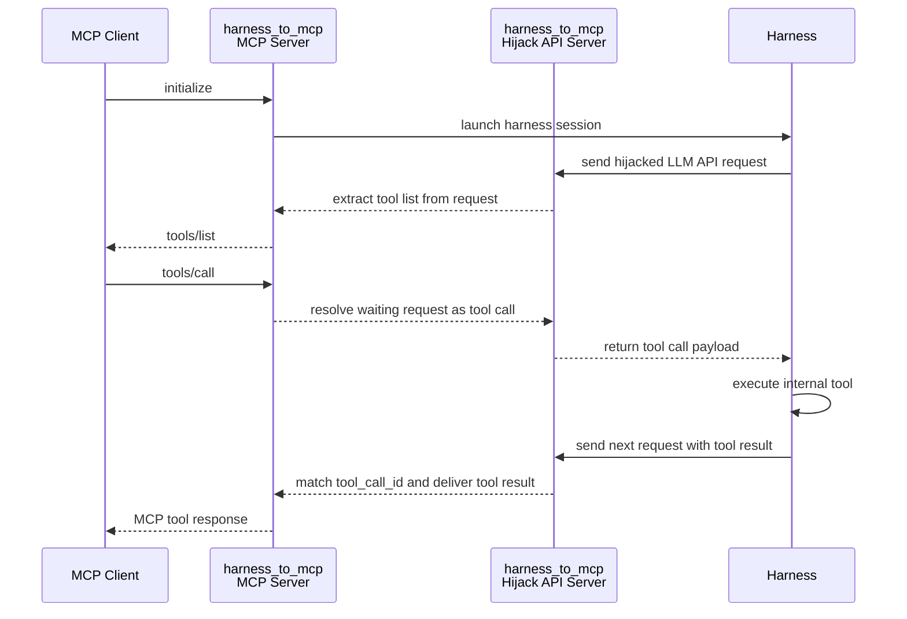

# `harness_to_mcp`: Expose harness internal tools as a standard MCP server

### Contents: [Features](#-features) | [Install](#-install) | [Demo](#-demo) | [How it works](#-how-it-works) | [Notes](#-notes)

Turn any agent harness (Claude Code, Codex, OpenClaw, OpenCode, ...) into an MCP server.

How: `harness_to_mcp` sits between the harness and its LLM API, grabs the tool list from the hijacked request, and routes MCP `tools/call` back into the harness tool loop.

## ▮ Features

- ☑ One command to expose `claude` / `codex` / `openclaw` / `opencode` as an MCP server
- ☑ Co-locates **one MCP HTTP server** and **one hijack LLM API server** on the same port
- ☑ Extracts the harness tool list automatically from intercepted LLM requests
- ☑ Mirrors captured harness system prompt into MCP `initialize.result.instructions`
- ☑ Forwards MCP `tools/call` into the harness tool loop and maps the tool result back
- ☑ Compatible LLM API protocols:
    - OpenAI Chat Completions (`openclaw`, `opencode`)
    - OpenAI Responses (`codex`)
    - Anthropic Messages (`claude`)
- ☑ Isolated harness config — will **not** pollute the user's own config and logs
- ☑ One harness process per MCP session, the harness process is stopped automatically on session close
- ☑ Plain server mode for bringing your own harness
- ☑ Pure-Python, clean dependencies — easy to hack and vibe-code on

## ▮ Install

```bash
pip install harness_to_mcp
```

The target harness CLI (`claude`, `codex`, `openclaw`, ...) needs to be installed separately and available on `PATH`.

## ▮ Demo

#### 1. One-liner to expose a harness as MCP

```bash
harness_to_mcp claude
# or: harness_to_mcp codex / openclaw / opencode
```

Each command starts a server and launches one corresponding harness instance. The harness is started with an isolated config, so it will not touch the user's own config or logs.

The MCP endpoint is then ready at:

```
http://127.0.0.1:<port>/mcp
```

Point any MCP client (Claude Desktop, Cursor, your own script, ...) at it and the harness's internal tools show up as standard MCP tools.

You can inspect the exposed tools with `python examples/list_tools.py`.

#### 2. Only run the server (plug in any harness)

```bash
harness_to_mcp
```

This mode starts **only** the server. It listens on MCP plus all hijack LLM API routes, but does not launch any harness by itself. Configure your harness's LLM API as the hijack API, send one request, and its internal tools are exposed on MCP. This is also how you plug in `claude` / `codex` / `openclaw` / `opencode` with your own custom config.

Exposed endpoints:

| Purpose                 | Path                                                         |
| ----------------------- | ------------------------------------------------------------ |
| MCP                     | `POST /mcp`  *(alias: `POST /harness_to_mcp/mcp`)*           |
| OpenAI Chat Completions | `POST /harness_to_mcp/v1/chat/completions`                   |
| OpenAI Responses        | `POST` / `WebSocket` `/harness_to_mcp/v1/responses`         |
| Anthropic Messages      | `POST /harness_to_mcp/v1/messages`                           |

#### 3. Python API

We also provide a Python interface:

```python
from harness_to_mcp import HarnessToMcp

with HarnessToMcp(port=9330) as server:
    print(server.mcp_url)          # e.g. http://127.0.0.1:9330/mcp
    print(server.hijack_base_url)  # e.g. http://127.0.0.1:9330/harness_to_mcp
```

## ▮ How it works



In short:

1. MCP client calls `initialize` → we spawn a harness.
2. The harness fires off its first LLM request (with the tool schema in it) → we intercept the request, extract the tool list, and reply to the MCP client with `tools/list`.
3. MCP client calls `tools/call` → we complete the pending LLM response as a **tool call**, the harness executes its internal tool, and sends the result back in the next LLM request.
4. We match the `tool_call_id`, extract the tool result, and return it as the MCP tool response.

## ▮ Notes

- The LLM API layer is split into reusable adapters: `chat completions`, `responses`, `messages`.
- The harness launcher layer is split per-harness: `opencode`, `openclaw`, `codex`, `claude`.
- Plain server mode (`harness_to_mcp` with no subcommand) never auto-launches a harness.
- Intercepted waiting requests are kept alive with periodic heartbeat bytes until MCP receives the next tool call.


## ▮ License

[The MIT License](https://en.wikipedia.org/wiki/MIT_License)
