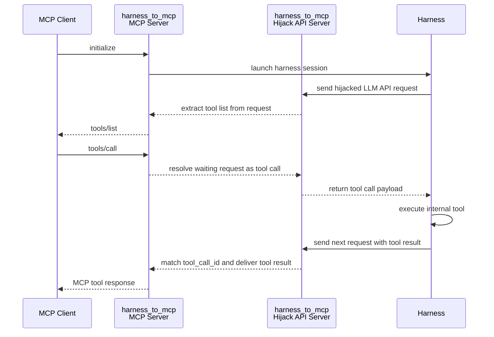

# `harness_to_mcp`: Expose harness internal tools as a standard MCP server by hijacking LLM API

### Contents: [Features](#-features) | [Install](#-install) | [Demo](#-demo) | [How it works](#-how-it-works) | [Python API](#-python-api) | [Notes](#-notes)

Turn any agent harness (Claude Code, Codex, OpenCode, OpenClaw, ...) into a plain MCP server — by sitting between the harness and its LLM backend, stealing the tool list from the hijacked request, and routing MCP `tools/call` back into the harness tool loop.

## ▮ Features

- ☑ One command to expose `claude` / `codex` / `opencode` / `openclaw` as an MCP server
- ☑ Co-locates **one MCP HTTP server** and **one hijack LLM API server** on the same port
- ☑ Extracts the harness tool list automatically from intercepted LLM requests
- ☑ Forwards MCP `tools/call` into the harness tool loop and maps the tool result back
- ☑ Compatible LLM API flavors:
    - OpenAI Chat Completions (`opencode`, `openclaw`)
    - OpenAI Responses (`codex`)
    - Anthropic Messages (`claude`)
- ☑ Isolated harness config — will **not** pollute the user's own config and logs
- ☑ One harness process per MCP session, stopped automatically on session close
- ☑ Plain server mode for bring-your-own third-party harness
- ☑ Heartbeat-kept hijacked requests, never time out while MCP is deciding the next tool call
- ☑ Pure-Python, no packaging magic — easy to hack and debug

## ▮ Install

```bash
pip install harness_to_mcp
```

Requires Python ≥ 3.10. The target harness CLI (`claude`, `codex`, `opencode`, ...) needs to be installed separately and available on `PATH`.

## ▮ Demo

#### 1. Expose a harness as MCP (one-liner)

```bash
harness_to_mcp claude
# or: harness_to_mcp codex / opencode / openclaw
```

Each helper command starts its own colocated server **and** launches one harness instance together. The harness is started with an isolated config, so it will not touch the user's own config or logs.

The MCP endpoint is then ready at:

```
http://127.0.0.1:<port>/mcp
```

Point any MCP client (Claude Desktop, Cursor, your own script, ...) at it and the harness's internal tools show up as standard MCP tools.

#### 2. Only run the server (bring-your-own harness)

```bash
harness_to_mcp
```

This mode starts **only** the server. It listens on MCP plus all hijack API routes, but does not launch any harness by itself. Configure your third-party harness to point at the hijack API, send one request, and its internal tools are exposed on MCP.

Exposed endpoints:

| Purpose                 | Path                                                         |
| ----------------------- | ------------------------------------------------------------ |
| MCP                     | `POST /mcp`  *(alias: `POST /harness_to_mcp/mcp`)*           |
| OpenAI Chat Completions | `POST /harness_to_mcp/v1/chat/completions`                   |
| OpenAI Responses        | `POST /harness_to_mcp/v1/responses`                          |
| Anthropic Messages      | `POST /harness_to_mcp/v1/messages`                           |

#### 3. Python API

```python
from harness_to_mcp import HarnessToMcp

with HarnessToMcp(port=9330) as server:
    print(server.mcp_url)          # e.g. http://127.0.0.1:9330/mcp
    print(server.hijack_base_url)  # e.g. http://127.0.0.1:9330/harness_to_mcp
```

## ▮ How it works



In short:

1. MCP client calls `initialize` → we spawn a harness.
2. The harness fires off its first LLM request (with the tool schema in it) → we intercept the request, extract the tool list, and reply to the MCP client with `tools/list`.
3. MCP client calls `tools/call` → we complete the pending LLM response as a **tool call**, the harness executes its internal tool, and sends the result back in the next LLM request.
4. We match the `tool_call_id`, extract the tool result, and return it as the MCP tool response.

## ▮ Notes

- The LLM API layer is split into reusable adapters: `chat completions`, `responses`, `messages`.
- The harness launcher layer is split per-harness: `opencode`, `openclaw`, `codex`, `claude`.
- Plain server mode (`harness_to_mcp` with no subcommand) never auto-launches a harness.
- Intercepted waiting requests are kept alive with periodic heartbeat bytes while MCP decides the next tool call.
- If the harness does not reconnect to the hijack API within 30 seconds, MCP requests fail with a `hijack-not-connected` error.

&nbsp;  
&nbsp;

**[Suggestions](https://github.com/on-panda/harness_to_mcp/issues) and pull requests are welcome** 😊

[中文 README](./README_cn.md)
