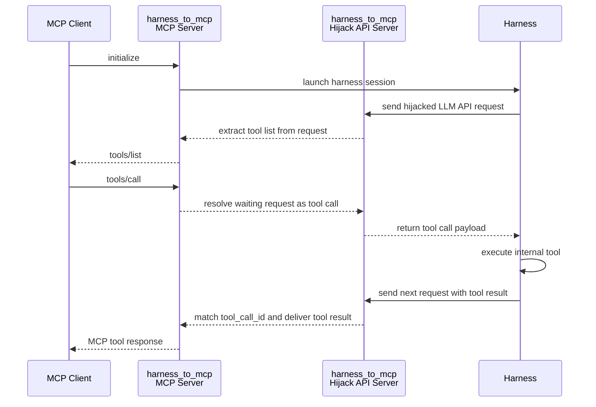

# `harness_to_mcp`: exposes harness internal tools as an MCP server by hijacking LLM API.

## What it does

- starts one MCP HTTP server and one hijack LLM API server on the same port
- starts one harness process per MCP session
- extracts the harness tool list from intercepted LLM requests
- forwards MCP `tools/call` into the harness tool loop and maps the tool result back to MCP
- stops the harness process when the MCP session is closed

## Supported harnesses

- `harness_to_mcp openclaw/opencode` via OpenAI chat completions
- `harness_to_mcp codex` via OpenAI responses API
- `harness_to_mcp claude` via Anthropic messages API

## Exposed endpoints
- MCP: `POST /mcp`, `POST /harness_to_mcp/mcp` (The two MCP paths are equivalent)
- OpenAI Chat Completions: `POST /harness_to_mcp/v1/chat/completions`
- OpenAI Responses: `POST /harness_to_mcp/v1/responses`
- Anthropic Messages: `POST /harness_to_mcp/v1/messages`

## Sequence



## Install

```bash
pip install harness_to_mcp
```

## Launch a harness directly

```bash
harness_to_mcp claude/codex/opencode/openclaw
```

Each helper command starts its own colocated server and one harness instance together. The harness will be started using an isolated config and will not pollute the user's own config and logs.

## Only run the server

```bash
harness_to_mcp
```

This mode starts only the server. It listens on MCP plus all hijack API routes, but does not launch any harness by itself. Users need to configure the hijack API for the harness and start a request to expose its internal tools.

## Python API

```python
from harness_to_mcp import HarnessToMcp

with HarnessToMcp(port=9330) as server:
    print(server.mcp_url)
    print(server.hijack_base_url)
```

## Notes

- the LLM API layer is split into reusable adapters for chat completions, responses, and messages
- the harness layer is split into reusable launchers for `opencode`, `openclaw`, `codex`, and `claude`
- plain server mode never auto-launches a harness
- intercepted waiting requests stay alive with periodic heartbeat bytes while MCP is deciding the next tool call
- if the harness does not reconnect to the hijack API within 30 seconds, MCP requests fail with a hijack-not-connected error
