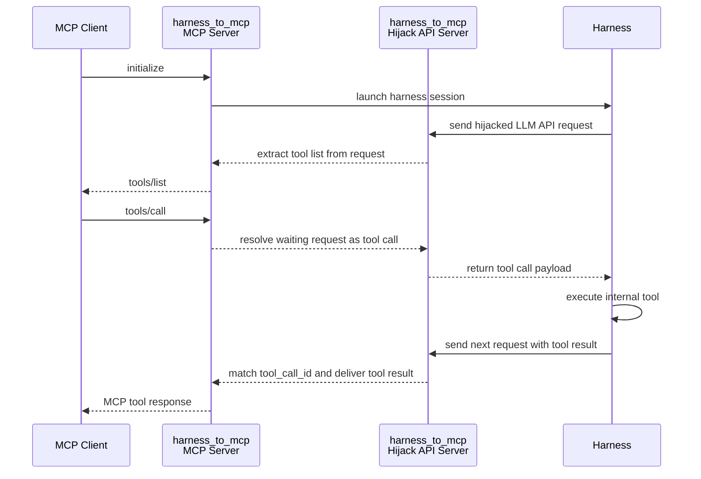

# `harness_to_mcp`: 通过劫持 LLM API 请求，把 harness 的内部 tools 暴露成一个 MCP server。

## 它做了什么

- 在同一个端口上启动一个 MCP HTTP server 和一个 hijack API server
- 每个 MCP session 对应启动一个 harness 进程
- 从被拦截的 LLM 请求里提取 harness 的 tool 列表
- 把 MCP `tools/call` 转发进 harness 的 tool loop，并把 tool result 再映射回 MCP
- 在 MCP session 关闭时停止对应的 harness 进程

## 当前支持的 harness

- `harness_to_mcp opencode`，通过 OpenAI chat completions API 接入
- `harness_to_mcp openclaw`，通过 OpenAI chat completions API 接入
- `harness_to_mcp codex`，通过 OpenAI responses API 接入
- `harness_to_mcp claude`，通过 Anthropic messages API 接入

## 暴露的接口
- MCP：`POST /mcp`、`POST /harness_to_mcp/mcp` (两个 MCP 路径是等价的)
- Models：`GET /harness_to_mcp/v1/models`
- OpenAI Chat Completions：`POST /harness_to_mcp/v1/chat/completions`
- OpenAI Responses：`POST /harness_to_mcp/v1/responses`
- Anthropic Messages：`POST /harness_to_mcp/v1/messages`

## 时序图



## 安装

```bash
pip install harness_to_mcp
```

## 启动服务

```bash
harness_to_mcp
```

这个模式只启动 server。它会同时监听 MCP 和所有 hijack API 路径，但不会自己拉起任何 harness。

## 直接启动某个 harness

```bash
harness_to_mcp claude/codex/opencode/openclaw
```

这些 helper 命令会各自启动一个同进程持有的 server，再拉起一个对应的 harness 实例。即使 harness 后续退出，server 进程仍然保持运行。

## Python API

```python
from harness_to_mcp import HarnessToMcp

with HarnessToMcp(port=9330) as server:
    print(server.mcp_url)
    print(server.hijack_base_url)
    print(server.anthropic_base_url)
```

## 设计说明

- LLM API 层已经拆成可复用 adapter，分别处理 chat completions、responses、messages
- harness 启动层已经拆成可复用 launcher，分别处理 `opencode`、`openclaw`、`codex`、`claude`
- 纯 server 模式不会自动拉起 harness
- 被拦截后处于等待状态的请求，会通过周期性 heartbeat 保活，直到 MCP 决定下一次 tool call
- 如果 harness 在 30 秒内没有重新连回 hijack API，MCP 请求会收到 hijack 未连接的错误
