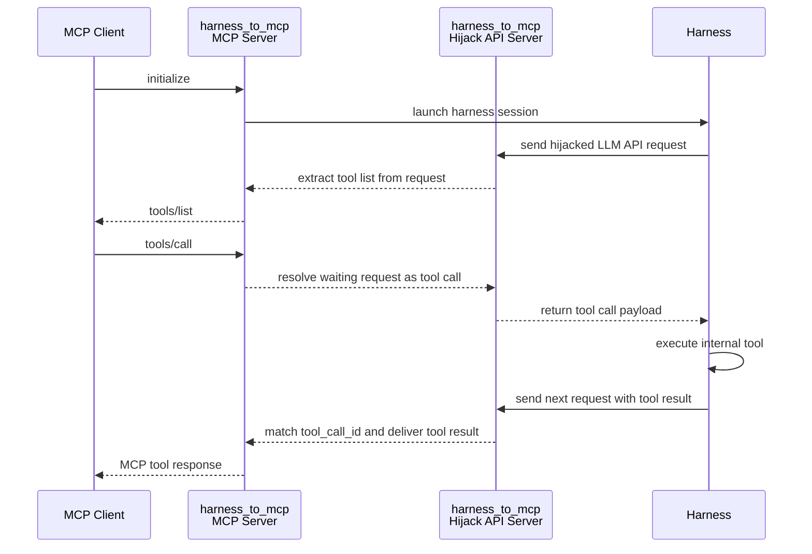

# `harness_to_mcp`：通过劫持 LLM API，把 harness 的内部 tools 暴露成一个标准 MCP server

### 目录：[特性](#-特性) | [安装](#-安装) | [示例](#-示例) | [工作原理](#-工作原理) | [Python API](#-python-api) | [说明](#-说明)

把任意 agent harness（Claude Code、Codex、OpenCode、OpenClaw……）变成一个普通的 MCP server —— 做法是：横在 harness 和它的 LLM 后端之间，从被劫持的请求里偷到 tool 列表，再把 MCP 的 `tools/call` 转发回 harness 的 tool loop。

## ▮ 特性

- ☑ 一条命令就能把 `claude` / `codex` / `opencode` / `openclaw` 暴露为 MCP server
- ☑ 同一个端口上同时跑 **一个 MCP HTTP server** 和 **一个劫持 LLM API server**
- ☑ 自动从被拦截的 LLM 请求里提取 harness 的 tool 列表
- ☑ 把 MCP `tools/call` 转发进 harness 的 tool loop，再把 tool result 映射回 MCP
- ☑ 兼容的 LLM API 协议：
    - OpenAI Chat Completions（`opencode`、`openclaw`）
    - OpenAI Responses（`codex`）
    - Anthropic Messages（`claude`）
- ☑ 使用隔离的 harness config —— **不会**污染用户自己的 config 和 log
- ☑ 每个 MCP session 对应一个 harness 进程，session 关闭时自动终止
- ☑ 提供纯 server 模式，便于接入第三方 harness
- ☑ 被拦截的请求用心跳保活，MCP 在决定下一次 tool call 期间永不超时
- ☑ 纯 Python 实现，没有复杂打包 —— 方便 hack 和调试

## ▮ 安装

```bash
pip install harness_to_mcp
```

需要 Python ≥ 3.10。对应的 harness CLI（`claude`、`codex`、`opencode`……）需要自行安装并放到 `PATH` 里。

## ▮ 示例

#### 1. 把某个 harness 暴露为 MCP（一行命令）

```bash
harness_to_mcp claude
# 或: harness_to_mcp codex / opencode / openclaw
```

这些 helper 命令会各自启动一个同进程的 server，并拉起一个对应的 harness 实例。harness 会使用隔离的 config 启动，不会污染用户自己的 config 和 log。

启动完成后，MCP 接口就在：

```
http://127.0.0.1:<port>/mcp
```

把任意 MCP 客户端（Claude Desktop、Cursor、自写脚本……）指过去，该 harness 的内部 tools 就会作为标准 MCP tools 出现。

#### 2. 只启动中转服务（接入第三方 harness）

```bash
harness_to_mcp
```

这个模式**只**启动 server。它会同时监听 MCP 和所有 hijack API 路径，但不会自己拉起任何 harness。把第三方 harness 的 LLM API 指向 hijack API，发一条消息，它的内部 tools 就会被暴露出来。

暴露的接口：

| 用途                    | 路径                                                         |
| ----------------------- | ------------------------------------------------------------ |
| MCP                     | `POST /mcp`  *（等价别名：`POST /harness_to_mcp/mcp`）*      |
| OpenAI Chat Completions | `POST /harness_to_mcp/v1/chat/completions`                   |
| OpenAI Responses        | `POST /harness_to_mcp/v1/responses`                          |
| Anthropic Messages      | `POST /harness_to_mcp/v1/messages`                           |

#### 3. Python API

```python
from harness_to_mcp import HarnessToMcp

with HarnessToMcp(port=9330) as server:
    print(server.mcp_url)          # 例如 http://127.0.0.1:9330/mcp
    print(server.hijack_base_url)  # 例如 http://127.0.0.1:9330/harness_to_mcp
```

## ▮ 工作原理



简单概括：

1. MCP 客户端调用 `initialize` → 我们拉起一个 harness。
2. harness 发出它的第一条 LLM 请求（里面带着 tool schema）→ 我们拦截请求，抽出 tool 列表，回给 MCP 客户端 `tools/list`。
3. MCP 客户端调用 `tools/call` → 我们把挂起的那条 LLM 响应补成一个 **tool call**，harness 执行它的内部 tool，再把结果放进下一条 LLM 请求里发回来。
4. 我们按 `tool_call_id` 对上，把 tool result 提取出来，作为 MCP tool 响应返回。

## ▮ 说明

- LLM API 层拆成了可复用 adapter：`chat completions`、`responses`、`messages`。
- harness 启动层按 harness 拆分：`opencode`、`openclaw`、`codex`、`claude`。
- 纯 server 模式（不带子命令的 `harness_to_mcp`）不会自动拉起 harness。
- 被拦截后处于等待状态的请求，会通过周期性 heartbeat 保活，直到 MCP 决定下一次 tool call。
- 如果 harness 在 30 秒内没有重新连回 hijack API，MCP 请求会收到 `hijack-not-connected` 错误。

&nbsp;  
&nbsp;

**欢迎 [提 issue](https://github.com/on-panda/harness_to_mcp/issues) 和 PR** 😊

[English README](./README.md)
